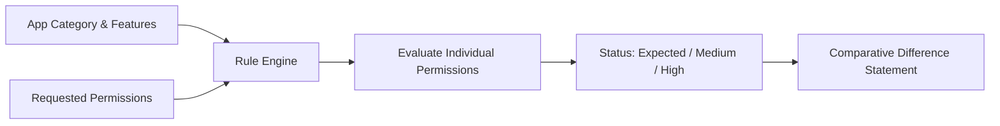

# 🛡️ WhyThisApp — Purpose-Aware Permission Comparison

> **Two apps. Same job. One clear answer about who asks for more.**

[](https://react.dev/)
[](https://www.typescriptlang.org/)
[](https://vitejs.dev/)
[](https://tailwindcss.com/)
[](LICENSE)

**WhyThisApp** is a privacy-first web application designed to demystify mobile permissions. When two apps claim to perform the exact same job, why does one request only hardware access while the other asks for your contacts, SMS, and precise location?

Instead of relying on black-box heuristics or subjective "threat scores", WhyThisApp implements a **deterministic, category-aware rule engine**. Every permission is judged within the context of the app's stated purpose and user-facing features.

---

## 🌟 Key Highlights

- 🎯 **Context-Driven Evaluation**: Permissions aren't universally "good" or "bad". For a Weather app, *Precise Location* is **Expected**. For a Flashlight app, that exact same permission is flagged as a **High Mismatch**.
- ⚙️ **Feature Awareness**: Smart feature flags (e.g. *Document Scanning* on a PDF Reader) dynamically adjust permission justifications, explaining *why* a camera is needed only when that feature is declared.
- 📐 **Deterministic Rule Engine**: 100% computed logic. No hallucinations, no arbitrary numbers, and zero opaque AI scoring. Transparent, auditable plain-English explanations.
- 📋 **Flexible Input Parsing**: Check off permissions interactively, or paste raw Android manifest strings (`android.permission.CAMERA`), comma-separated aliases, or plain English names.
- 🚀 **Interactive Pre-Loaded Demos**: Instant, one-click comparisons showcasing real-world app scenarios (Flashlight, PDF Reader, Weather Forecast).
- 🕒 **Saved History**: Comparisons are automatically saved to `localStorage` so you can review previous evaluations anytime.

---

## 🚦 Permission Status Breakdown

Every permission evaluated by WhyThisApp is categorized into one of three distinct statuses:

| Status | Badge | Description | Example |
| :--- | :--- | :--- | :--- |
| **Expected** | `🟢 Expected` | Directly aligns with core app category or declared features. | Flashlight toggling `Flash Control` or `Camera` (hardware driver). |
| **Medium Mismatch** | `🟡 Medium Mismatch` | Not strictly essential to core job; potential privacy impact or edge-case utility. | Storage access on a simple utility without file import features. |
| **High Mismatch** | `🔴 High Mismatch` | Completely unrelated to stated app job; strong privacy risk indicator. | Flashlight or Calculator requesting `Contacts`, `SMS`, or `Precise Location`. |

---

## 🧪 Built-In Demos

WhyThisApp ships with three interactive, pre-configured case studies:

1. **Torch / Flashlight (Hardware Utility)**
   - *App A (Minimal)*: Requests camera & flash control hardware drivers only.
   - *App B (Over-Permissive)*: Requests camera, contacts, GPS, and SMS.
   - *Takeaway*: A hardware light toggle requires zero access to address books or SMS.
2. **PDF Reader (Context-Aware Feature Toggles)**
   - *App A (Standard Viewer)*: Requires storage access.
   - *App B (Viewer requesting Camera)*: Flags Camera as a High Mismatch unless the **Document Scanning** feature is toggled on.
   - *Takeaway*: Purpose context matters—camera access is justified *only* if document digitization is an active feature.
3. **Weather Forecast (Purpose Alignment)**
   - *App A (Direct)*: Requests Precise Location (Expected for meteorological hyper-local forecast).
   - *App B (Data Collector)*: Requests Location, but bundles Contacts and SMS reading.
   - *Takeaway*: GPS is legitimate for weather, but communication logs have zero purpose correlation.

---

## 🛠️ Tech Stack

- **Core & Runtime**: [React 19](https://react.dev/) + [TypeScript](https://www.typescriptlang.org/)
- **Bundler & Build Tool**: [Vite 8](https://vitejs.dev/)
- **Styling**: [Tailwind CSS 3.4](https://tailwindcss.com/) with custom teal/brand palette & PostCSS
- **Icons**: [Lucide React](https://lucide.dev/)
- **Typography**: Plus Jakarta Sans & JetBrains Mono (via Google Fonts)

---

## 📂 Project Structure

```text
WhythisApp/
├── public/                 # Static assets and icons
├── src/
│   ├── assets/             # Images and design assets
│   ├── components/
│   │   ├── compare/        # Form inputs, category selectors, permission checklists & paste parsers
│   │   ├── demo/           # Interactive demo selector cards & controls
│   │   ├── history/        # Local history list & comparison restoring
│   │   ├── home/           # Hero section, feature principles & 'How It Works' guide
│   │   ├── layout/         # Navigation header & footer
│   │   └── results/        # Side-by-side comparison cards, mismatch badges & explanation lists
│   ├── data/
│   │   ├── demoData.ts     # Pre-configured demo scenarios and presets
│   │   └── permissions.ts  # Permission catalog, aliases, and category definitions
│   ├── engine/
│   │   └── ruleEngine.ts   # Deterministic evaluation logic and comparison calculations
│   ├── pages/
│   │   ├── Compare.tsx     # Custom app comparison view
│   │   ├── Demo.tsx        # Preset scenario demonstration view
│   │   └── Home.tsx        # Landing page with architecture principles
│   ├── types/
│   │   └── index.ts        # Core TypeScript interfaces and domain models
│   ├── App.tsx             # Root application component with tab navigation
│   ├── index.css           # Global stylesheet and Tailwind directives
│   └── main.tsx            # Application entry point
├── index.html              # HTML shell with meta tags and font imports
├── package.json            # Project dependencies and npm scripts
├── tailwind.config.js      # Custom theme color tokens and extensions
├── tsconfig.json           # TypeScript configuration
└── vite.config.ts          # Vite configuration with React plugin
```

---

## ⚡ Getting Started

### Prerequisites

- [Node.js](https://nodejs.org/) (version `18.0.0` or higher recommended)
- `npm`, `pnpm`, or `yarn`

### 1. Clone & Install

```bash
# Clone the repository
git clone https://github.com/your-username/WhythisApp.git

# Navigate to project directory
cd WhythisApp

# Install dependencies
npm install
```

### 2. Run the Development Server

```bash
npm run dev
```

Open your browser and navigate to `http://localhost:5173` (or the port specified in your terminal).

### 3. Build for Production

```bash
# Type check and build bundle
npm run build

# Preview production build locally
npm run preview
```

---

## 💡 How It Works Under The Hood



1. **Category Definition**: You select the app's declared category (`torch`, `pdf`, or `weather`).
2. **Feature Flags**: Any special capabilities (such as *Document Scanning*) are noted.
3. **Permission Intake**: Permissions are selected or parsed from raw text using fuzzy alias matching (e.g. `android.permission.ACCESS_FINE_LOCATION` ➔ `location_precise`).
4. **Deterministic Analysis**: The engine evaluates each permission against category necessity rules, generating an audit reason and user-friendly explanation.
5. **Comparative Synthesis**: The tool compares App A and App B, identifying unique permissions, shared permissions, and generating an objective difference summary.

---

## 🤝 Contributing

Contributions, bug reports, and feature requests are welcome!
To add a new category or extend permission rules:
1. Add new permission definitions to [src/data/permissions.ts](file:///c:/Users/disha/Desktop/WhythisApp/src/data/permissions.ts).
2. Define evaluation rules in [src/engine/ruleEngine.ts](file:///c:/Users/disha/Desktop/WhythisApp/src/engine/ruleEngine.ts).
3. Add demo presets in [src/data/demoData.ts](file:///c:/Users/disha/Desktop/WhythisApp/src/data/demoData.ts).

---

## 📄 License

This project is licensed under the [MIT License](LICENSE).
